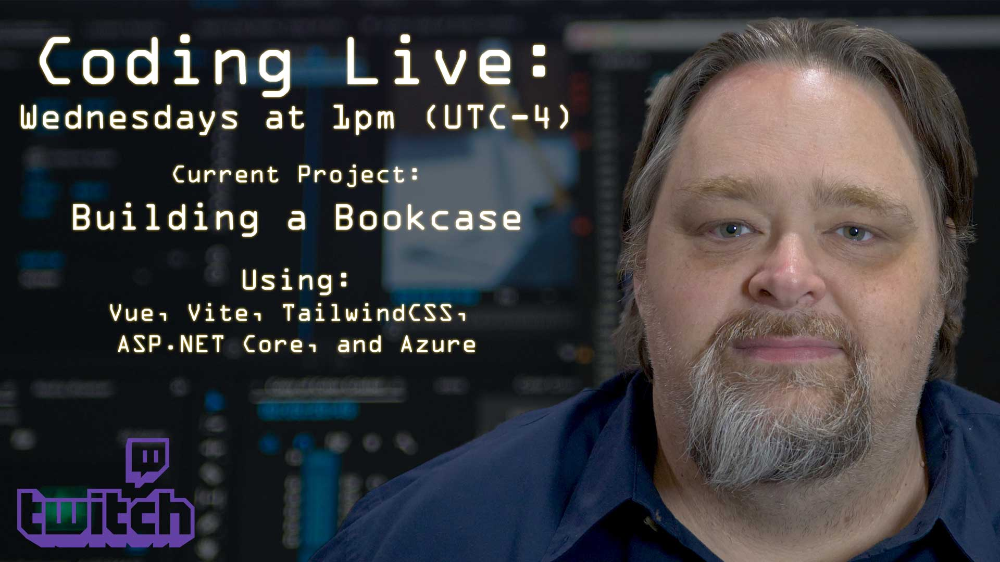

# WilderStream Project

This repo is dedicated to the on-going work on the Bookcase example project that I'm building on Twitch each week. 

The goal fo the example is to build an app that will let you store books you've read. We're using the Open Library API to find books.

The technologies that are going to be used include:

- Vue
- Tailwind CSS
- Visual Studio Code
- Visual Studio 2022
- .NET 6
- Azure App Services
- Cosmos DB

Join me each week to watch me build the project. No script, no pre-created code &mdash; just watch me figure stuff out live. 

> [Twitch Stream](https://twitch.tv/shawnwildermuth)